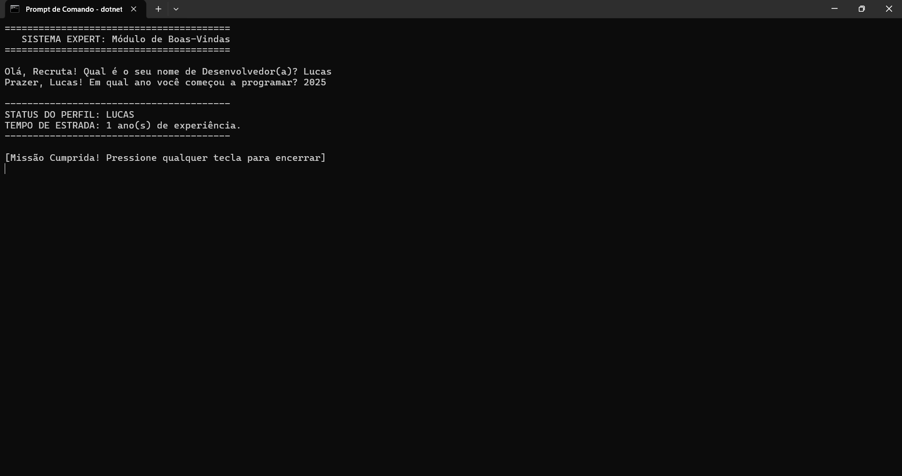

# 🏗️ LabDotnet: Desafio Arquiteto de Sistemas (Lista 02)

Este repositório contém o desenvolvimento de um sistema de console utilizando o ecossistema **.NET**, focado na automação de tarefas via terminal e na implementação de uma interface de linha de comando (CLI) com foco em UX/IHC.

---

## 🚀 O Desafio

O objetivo desta atividade foi abandonar a interface gráfica e construir um ambiente de desenvolvimento completo utilizando estritamente o terminal (CMD/PowerShell).

### Etapas de Construção:
1. **Preparação do Ambiente:** Criação do diretório de laboratório `LabDotnet`.
2. **Scaffolding:** Geração de um novo projeto de console através do comando `dotnet new console -n SistemaExpert`.
3. **Compilação e Execução:** Validação do ciclo de vida do software com `dotnet build` e `dotnet run`.
4. **Refatoração de Código:** Implementação de lógica em C# para cálculo de tempo de experiência e formatação de saída (Upper Case e interpolação de strings).

---

## ⚡ Comandos Utilizados

Além dos comandos básicos de navegação, foram exploradas ferramentas da CLI do .NET:

- `dotnet new console`: Cria um novo projeto de aplicação de console baseado em um template.
- `dotnet build`: Compila o projeto, verificando erros de sintaxe e gerando os binários.
- `dotnet run`: Compila (se necessário) e executa a aplicação imediatamente.
- `DateTime.Now.Year`: Propriedade do C# utilizada para capturar o ano atual dinamicamente no sistema.

---

## 💻 O Código (Program.cs)

A lógica implementada foca na interação com o usuário (Recruta) e no processamento de dados simples:

```csharp
// Exemplo da lógica de cálculo de jornada:
int anoInicio = int.Parse(entradaAno);
int anosDeJornada = DateTime.Now.Year - anoInicio;
```

---

## 📸 Evidência de Execução ("A Prova do Crime")

Abaixo, a captura de tela demonstrando o sistema em pleno funcionamento, após a execução do comando `dotnet run`:



---
**Desenvolvido por Lucas Nery Miranda** *Estudante de Ciência da Computação - UNA Contagem*
